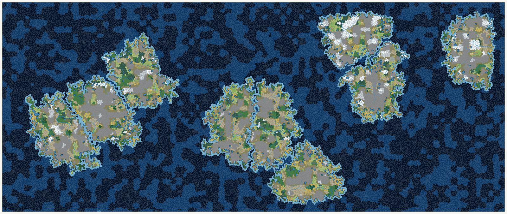

# wgvc



`wgvc` generates deterministic, province-first game worlds on one relaxed
Voronoi mesh, with islands grown in interleaved rounds that merge when they
touch, shared polygon topology, and spatially correlated terrain. The map above is the `subaru`
archipelago, grown from 21 weighted sites and three repulsors with
`-attractors subaru` (see [TNYC maps](#tnyc-maps)), downscaled from 5442×2206.

The included `generate` command exposes the complete growth configuration
and writes canonical JSON world data as well as terrain-colored SVG and PNG
maps at automatically derived dimensions.

## Usage

```go
package main

import (
	"fmt"
	"log"

	"github.com/mdhender/wgvc"
)

func main() {
	world, err := wgvc.Generate(wgvc.Config{
		WorldSeed:     42,
		ProvinceCount: 100,
		IslandCount:   8,
		AspectRatio:   wgvc.AspectRatioWidescreen,
	})
	if err != nil {
		log.Fatal(err)
	}

	fmt.Printf("%d islands, %d total land and water provinces\n",
		len(world.Islands), len(world.Provinces))
	for _, provinceID := range world.Islands[0].ProvinceIDs {
		province := world.Provinces[provinceID]
		fmt.Printf("province %d: %s, %d corners\n",
			province.ID, province.Terrain, len(province.CornerIDs))
	}
}
```

The required input constraint is:

```text
ProvinceCount >= IslandCount >= 1
```

Every successful call returns exactly the requested number of land provinces.
`AspectRatio` accepts width:height values such as `1:1`, `4:3`, `16:9`, and
`2.39:1`. It also accepts the aliases `landscape` (`4:3`), `portrait` (`3:4`),
`widescreen` (`16:9`), and `cinematic` (`2.39:1`). The zero value is `1:1`.
Changing the ratio changes the map bounds but not their area or point budget.
`IslandCount` is the number of initial seeds; directly connected islands merge,
so the returned world may contain fewer islands. A world-level ocean mesh covers
the space between and around land and can include enclosed growth-water
provinces. Water provinces use `NoIslandID` and do not appear in
`Island.ProvinceIDs`; `IslandID` remains the authoritative land/water assignment
independently of terrain vocabulary.
For a fixed version of this generator, identical `Config` values produce deeply identical `World` values.
Generation stages use independent deterministic random streams, so consuming
randomness in elevation or climate generation cannot perturb island placement
or province tessellation. Terrain classification itself consumes no randomness.
A newer generator version may intentionally change generated output for the
same configuration.

## World topology

The returned geometry is indexed:

- Each `Island`, `Province`, `Corner`, and `Edge` has an ID equal to its index
  in the corresponding `World` slice.
- `Island.ProvinceIDs` lists the island's land provinces in canonical order.
- `Province.IslandID` identifies its island for land and is `NoIslandID` for
  water.
- `Province.CornerIDs` is a counterclockwise polygon ring without a repeated
  closing corner. `Province.Center` is its original Voronoi generating point,
  not its polygon centroid.
- `Province.EdgeIDs` lists the boundary edges in the same ring order:
  `EdgeIDs[i]` joins `CornerIDs[i]` to `CornerIDs[(i+1) % n]`.
- `Province.Exits` numbers those edges from 1 clockwise from north, each with
  its neighbor (or `NoProvinceID` on the world boundary), a bearing in degrees
  clockwise from north, and an informative 8-point compass label. See
  [About exits, bearings, and compass points](docs/explanations/bearing-not-compass.md).
- `Province.Area` and `Edge.Length` are in world units, where the mesh is
  scaled so land provinces have a mean area of exactly 1.
- `Corner.Elevation` is the elevation noise at the corner; an edge's elevation
  is the mean of its corners'.
- `World.Rivers` are chains of land-land edges from source to mouth, with
  discharge, a class (stream, river, major river), and where each rises and
  ends (spring, basin outflow, ocean, basin, or a confluence). `Edge.RiverID`
  and `Edge.Discharge` link edges back to them. See
  [Rivers](#rivers) below and the [contracts](docs/generation.md).
- `Province.CoastDistance` is the hop count through the province's own medium
  to the nearest coast, so coastal land and coastal water are 0.
- `World.SeaZones` partition the ocean into contiguous regions of about 200
  provinces for naming seas; `Province.SeaZoneID` names a province's zone.
  `World.Straits` are water crossings of at most 3 provinces between two
  islands, and `World.Necks` are land isthmuses of at most 3 provinces whose
  removal splits an island into two regions of at least 10. See
  [Seas, straits, and necks](#seas-straits-and-necks).
- Coastal land provinces carry siting inputs: `OceanEdges` and `BasinEdges`,
  `Shelter` (how enclosed the adjacent water is, in `[0, 1]`), and the rivers
  along them (`RiverIDs`), ending at them (`RiverMouthIDs`), and joining at
  them (`ConfluenceIDs`). They are measures for a consumer's own settlement
  placement, not placements.
- `World.Features` are nameable units: connected same-family terrain regions
  of at least 5 provinces (mountain ranges, hill country, plateaus, forests,
  deserts, wetlands, ice fields) and archipelagos of islands within 6 water
  provinces of each other.
- Corners and edges are shared objects. An `Edge` references two corners and
  either one province at the outside of the world or two provinces inside it.
  A coastline edge joins one land province to one water province.

Interior edge incidence is authoritative **undirected geometric adjacency**:
two provinces are adjacent when they share a boundary. It is not a game route.
Future routes may be directed, so `A -> B` and `B -> A` will be separate
decisions rather than consequences of geometric adjacency.

The generator creates and Lloyd-relaxes one point set for the entire world,
then plants one seed per island and grows all islands across that mesh in
interleaved rounds, one cell at a time, using a static desirability field. A permanent ocean barrier keeps land
off the map boundary, while optional regional attractants can bias growth
toward selected parts of the interior. A rival ramp makes cells near another
island's land undesirable, so islands keep a channel of one to three water
provinces between them and rarely merge; directly connected islands still
merge, and interior lakes remain valid. The coastline can form bays and promontories while
every province remains one convex polygon.

The deterministic [single-mesh island gallery](docs/blob-islands.svg) shows tiny,
medium, large, and multi-island fixtures without terrain colors. See
[Single-mesh island generation](docs/blob-islands.md) for the pipeline, guarantees,
resolution limits, regression fixtures, and reproduction command.

## Render a map

The `generate` command runs the desirability-field generator and writes a
terrain map as SVG by default. The demo parameters generate a cinematic PNG
with 25 initial islands, 3,500 land provinces, 75% water, and five attractors:

```sh
go run ./cmd/generate -seed 0x0123456789abcdef \
  -islands 25 -provinces 3500 -ocean 0.75 \
  -aspect cinematic -attractors 5 -format png -output world
```

### TNYC maps

TNYC uses about 10,000 land provinces on a cinematic map. The goal map is 27
initial islands at 78% water with all nine attractors, which fills every region
of the map with an island of 330 to 410 provinces and leaves neighbors separated
by straits of one to three water provinces. The rival ramp keeps the islands
apart, so the initial island count is normally the final landmass count; this
seed merges one pair in the crowded center for 26 landmasses. A continent is
grown the other way, by disabling the ramp so that 25 islands at 45% water merge
into one landmass with inland seas and bays; a single initial island instead
grows into one featureless block against the map edge. Dimensions below are at
the default `-scale 3`; [How to regenerate the README maps and doc
images](docs/how-to/recipes.md) lists every recipe with its expected status
line.

```sh
# Goal map: 27→26 islands, 45,455 provinces, 15965×6764
go run ./cmd/generate -seed 0x0123456789abcdef \
  -islands 27 -provinces 10000 -ocean 0.78 \
  -aspect cinematic -attractors 9 -format png -output tnyc

# Subaru archipelago (the README header): 21→6 islands, 45,455 provinces, 16325×6617
go run ./cmd/generate -seed 0x0123456789abcdef \
  -islands 21 -provinces 10000 -ocean 0.78 \
  -attractors subaru -format png -output subaru

# Draco: 35→1 islands with an inland sea in the head, 71,429 provinces, 17249×9766
go run ./cmd/generate -seed 0x0123456789abcdef \
  -islands 35 -provinces 10000 \
  -attractors draco -format png -output draco

# Aster: the dragon as 25→14 islands behind a kin head, 62,500 provinces, 16144×9144
go run ./cmd/generate -seed 0x0123456789abcdef \
  -islands 25 -provinces 10000 \
  -attractors aster -format png -output aster

# Little Dipper: 7→7 islands, 45,455 provinces, 14617×7381
go run ./cmd/generate -seed 0x0123456789abcdef \
  -islands 7 -provinces 10000 -ocean 0.78 \
  -attractors ursa-minor -format png -output ursa-minor

# One continent: 25→1 islands, 18,182 provinces, 10151×4331
go run ./cmd/generate -seed 0x0123456789abcdef \
  -islands 25 -provinces 10000 -ocean 0.45 -rival-ramp 0 \
  -aspect cinematic -attractors 5 -format png -output tnyc-continent
```

| Map | Landmasses (provinces each) | Wall time | Max resident memory |
|---|---|---:|---:|
| `tnyc` | 26 (692, then 25 between 326 and 408) | 4.6 s | 244 MiB |
| `tnyc-continent` | 1 (10,000) | 2.4 s | 99 MiB |

Timings are for a built binary writing PNG only, measured with
`/usr/bin/time -l` on an Apple M4 at v0.7.21-alpha. The remaining merges happen
where islands are crowded against each other or the map edge: 15 initial
islands with nine attractors ended with 12 landmasses, two of them fused along
the map edge, and 12 islands with five attractors at 65% water ended with 10 or
11 across five seeds. Lowering `-temperature` to 0.05 makes the ramp decisive
(12 of 12 on every seed), a wider ramp such as `-rival-ramp=-1,-1,-1,-0.5,0`
widens the channels, and `-rival-ramp 0` restores free merging so that only
`-ocean` separates islands.

Use `-format png` for `world.png`, `-format json` for `world.json`, or
`-format both` to write `world.svg` and `world.png`. Comma-separated values such
as `-format svg,json` select any combination, and `-format all` writes all three
files. The `-output` value is a path without an extension. SVG and PNG dimensions
are derived from the requested land-province count, the effective ocean
percentage, and the aspect ratio, then multiplied by `-scale`, which defaults
to 3. The scale also multiplies the margin and every stroke width, so a scaled
map is the unscaled map drawn at a higher resolution; the default keeps the
anti-aliased fringe on a border a small fraction of the line, and `-scale 1`
restores the earlier one-pixel borders. Both image formats use the same terrain
fills, thin cell borders, heavier coastline, and blue river lines whose width
follows the flow on each edge.
The `-aspect` flag accepts `landscape`, `portrait`, `widescreen`, and
`cinematic` as aliases for their corresponding numeric ratios.

JSON output contains the canonical indexed world topology in Cartesian world
coordinates; it does not contain pixel coordinates or rendering styles. The file
is one compact line by default; `-pretty` indents it for reading, at roughly
twice the size. Its top-level shape is:

```json
{
  "schema_version": 11,
  "generation": {
    "generator": { "version": "0.8.7-alpha", "build": "9a64246" },
    "config": { "seed": "0x0123456789abcdef" },
    "result": { "province_count": 4688, "land_province_count": 1500 }
  },
  "bounds": { "minimum": { "x": 0, "y": 0 }, "maximum": { "x": 68, "y": 68 } },
  "minimum_passable_edge_length": 0.15,
  "islands": [],
  "basins": [],
  "provinces": [],
  "corners": [],
  "edges": [],
  "rivers": [],
  "sea_zones": [],
  "straits": [],
  "necks": [],
  "features": []
}
```

The abbreviated objects above omit fields and collection entries. IDs equal
their array indexes, polygon rings refer to shared corners, each province also
lists its boundary `edge_ids` in ring order, its numbered `exits`, and its
`area`, edges refer to their
incident provinces and carry their `length`, water provinces use
`island_id: -1`, and provinces outside any basin use `basin_id: -1`. Terrain and climate
bands are descriptive strings. `minimum_passable_edge_length` is the length in
world units below which an edge is too short to be a border a player may
cross; such edges stay in the mesh and the export so maps draw correctly, and
a consumer moving between provinces ignores exits whose edge is shorter. The seed is a hexadecimal string so all 64 bits
survive parsers whose numeric values use IEEE-754 doubles.
`generation.generator` records the generator version (without build metadata)
and, when available, the commit the binary was built from; see
[Generation contracts](docs/generation.md#json-export).

Attractants are disabled by default. Use `-attractors` with 1 through 6 to
select regions in the familiar die-face pattern, or 9 to select every region
of the 3×3 grid. Zero disables them. A constellation name (`ursa-minor`, the
seven stars of the Little Dipper; `cygnus`, eight stars of the Northern Cross;
`virgo`, eleven stars spread along the ecliptic; `draco`, a winding dragon of
thirty-five kin sites with an inland sea in its head; `aster`, the same
dragon as a chain of separate islands behind a kin head; or `subaru`, twenty-one sites
laid out like the Japanese archipelago) instead places one attractor per star, scaled to fill the map while keeping the
figure's proportions, without jitter, and seeds the first islands on the star
cells so each star grows its own island. A constellation also selects the map
shape it was drawn for (`2:1` for `ursa-minor` and `virgo`, `3:2` for
`cygnus`, `5:2` for `subaru`, `16:9` for `draco` and `aster`) unless `-aspect`
is given,
and may select an ocean fraction the same way (`draco` uses 86% so its single
winding landmass stays thin, `aster` 84% so its beads show water between them)
unless `-ocean` is given. A constellation can
mark stars as kin: their islands ignore each other's rival ramp, merge when
they touch, and the merged landmass keeps every star's share of growth, which
is how `subaru` grows a twelve-star mainland and a four-star northern island
beside single-star ones. Each site may also carry a weight. A positive weight
is the island's share of growth draws relative to the others, so `subaru`'s
two western islands weigh 0.5 and grow to half size. A negative weight makes
the site a repulsor that seeds nothing and lowers desirability around itself
by `-repulsor-ramp` scaled by the weight's magnitude, reaching about twenty
hops by default; `subaru` uses three to hold open an inland sea, a bay on the
mainland's south coast, and the strait to the northern island. The JSON
result lists repulsor provinces in `generation.result.repulsor_province_ids`. The
JSON export lists the provinces that hosted the sources in
`generation.result.attractant_province_ids`. For example:

```sh
go run ./cmd/generate -attractors 5 -output five-attractors
```

The command exposes all growth controls, including `-ocean`, `-edge-barrier`,
`-edge-ramp`, `-attractant-ramp`, `-attractant-jitter`, `-temperature`,
`-rival-ramp`, `-repulsor-ramp`, `-rounds`, and `-relaxations`. Climate calibration is
controlled by `-polar-ice` and `-peak-chill`, both expressed as percentages. Run
`go run ./cmd/generate -h` for their defaults and descriptions. `-version`
prints the generator version and exits; a built binary appends the commit it
was built from as semver build metadata.

`-summary` also prints, after the status line, the number of provinces in each
elevation band, heat band, moisture band, and terrain, and the number of rivers
in each class, followed by each histogram's total. Every declared value is listed in declaration order, and
values no province has print `0`:

```sh
go run ./cmd/generate -summary -format json
```

`-region`, `-select`, and `-radius` render a partial map for a player who only
knows part of the world. `-region minx,miny,maxx,maxy` selects the provinces
whose centers lie in that world-coordinate box, `-select 12,34` names province
IDs, and `-radius n` grows the union of both by `n` province hops. The image is
cropped to the selection plus the usual margin at exactly the full map's scale
and on its pixel grid, so partial maps of one world line up with each other and
with the full map. Unselected provinces inside the crop are drawn as fog, with
borders but no terrain, coastline, or river. JSON output is unaffected and
always describes the whole world:

```sh
go run ./cmd/generate -select 120 -radius 4 -format png -output home
go run ./cmd/generate -region 10,10,30,25 -format svg -output northwest
```

`-layer` chooses the province field that colors SVG and PNG maps. JSON output
is unaffected, and cell borders, coastlines, and the background are the same
for every layer:

| Layer | Colors each province by |
|---|---|
| `terrain` | its terrain (the default) |
| `elevation` | elevation, deep ocean through shelf, then a hard step at sea level to coastal green, upland brown, and snow; the side of the step follows land/water membership |
| `relief` | relief, dark (flat) to pale (rugged), over a fixed display range of `[0, 0.4]`; higher values saturate |
| `heat` | heat, blue (cold) through neutral to red (hot) |
| `moisture` | moisture, ochre (dry) through neutral to deep green (wet) |
| `climate` | its heat band × moisture band, one color per cell of the 5×5 table |

Ramps cover a fixed range (`[-1, 1]` for elevation, `[0, 1]` for heat and
moisture) rather than stretching to the values a world happens to contain, so
two maps are comparable. Relief is the exception: it is nominally in `[0, 1)`,
but as a mean of neighbor differences it rarely passes 0.3 (the 99th percentile
of land relief is 0.23 to 0.31 across seeds and sizes), so its layer spans
`[0, 0.4]`. On that scale the terrain thresholds land at 30% (wetland cap
0.12), 35% (hills 0.14), 40% (mountains 0.16), and 50% (badlands 0.20), around
the ramp's first color break, so flat, hilly, and mountainous regions separate
visibly. Unknown layer names are rejected:

```sh
go run ./cmd/generate -layer heat -format png -output heat
```

See [Desirability-field growth](docs/x24.md) for the rules and defaults. The
public `Generate` API uses those defaults, including zero attractants; these
tuning flags do not expand its `Config`.

## Terrain

Terrain is a deterministic final classification derived from island membership,
elevation, relief, heat, moisture, and coastal adjacency. It has no independent
noise field. `Terrains` returns the complete vocabulary in stable family order:
ocean, inland water, frozen, wetland, dry, open land, forest, elevated,
volcanic, and coast. `Terrain.IsWater` recognizes both ocean and inland-water
values.

Classification considers ocean depth first, then glacial ice, elevated terrain,
wetlands, coastal land, rough dry or upland terrain, and finally a heat ×
moisture cover table. Water next to growth-assigned land is coastal water; low,
growth-assigned land next to water can be coast. `volcano` and
`volcanic-highland` are reserved for volcanism (issue #40) and are not currently
emitted.

The [terrain legend](docs/references/terrain-legend.md) shows each terrain's
map color and the exact rule that assigns it.

Water that cannot reach the world boundary through other water forms a basin:
a connected body enclosed by land. Every member of a basin shares one terrain,
`inland-sea` for basins of 10 or more provinces and `lake` otherwise, taking
precedence over coastal water. A basin's `SurfaceElevation` is the lowest
elevation of the land provinces around it, the height at which it would spill;
members keep their water elevation as depth below that surface, and `Depth` is
the deepest. Basins come only from growth-assigned water, so they never change
whether a province is land or water; shorelines are exactly the growth
coastline.

The seeded elevation field is sampled once per shared corner. Land-land edges occupy
`[0.1, 1)`, water-water edges occupy `[-1, -0.1)`, and coastlines and world
boundaries remain exactly at sea level (`0`). A province keeps the mean of its
boundary-edge elevations and an ordered elevation band: deep water, shallow
water, lowland, upland, highland, or mountain. Island membership remains the
authority for land and water, including provinces whose mean elevation is zero.

| Growth assignment | Mean edge elevation | Elevation band |
|---|---:|---|
| water | `< -0.5` | deep water |
| water | `>= -0.5` | shallow water |
| land | `< 0.2` | lowland |
| land | `>= 0.2` and `< 0.4` | upland |
| land | `>= 0.4` and `< 0.6` | highland |
| land | `>= 0.6` | mountain |

Terrain assignment never removes provinces or changes geometry, island
membership, adjacency, or the growth-assigned land/water decision.

Relief measures local roughness rather than height. A province's relief is the
mean absolute elevation difference across its shared edges with same-medium
neighbors (land with land, water with water):
`relief(p) = mean(|p.Elevation - neighbor.Elevation|)`. World-boundary and
coastline edges are ignored, so the sea-level step at the coast never counts.
Because land and water elevations each span a unit-wide range, relief is
naturally in `[0, 1)`; a province with no same-medium neighbor has relief `0`.
The pass consumes no randomness. Typical land relief is about 0.09 (median),
with the roughest tenth above about 0.17.

Terrain reads relief at five thresholds: highland with relief `>= 0.16` is
mountain, highland with relief `< 0.07` is plateau (high and flat) and the rest
of the highland band is hills, upland with relief `>= 0.14` is hills, dry land
with relief `>= 0.20` is badlands, and humid lowland is a wetland only when its
relief is `<= 0.12`.

## Rivers

Rivers run along province edges, corner to corner, between two land provinces;
they never cross water, and they leave geometry and membership untouched.
Drainage works on the corner graph. Every corner touching ocean is an outlet,
and a priority-flood from the outlets visits the remaining corners in order of
filled elevation, so each gets one downstream neighbor and a monotone path to
the sea while depressions fill to their spill level instead of trapping flow.
A corner's downstream neighbor is the visited neighbor with the lowest filled
elevation; on a tie the sea wins over any other corner, then the steeper
descent, then the shorter edge, then the lower corner ID, so a coastal corner
beside both a lake and the sea drains to the sea. The filled surface is not
exported. Lakes
and inland seas are ordinary nodes: rivers flowing in end at the shore with a
`basin` mouth, and the basin's water leaves at its spill corner as a river with
a `basin` source. Each land province spreads `Area * Moisture` over its corners
as runoff, so wet regions grow larger rivers, and runoff accumulates downstream
into `Edge.Discharge`.

An edge carrying at least 4 units of discharge is a river edge (a province of
mean area and moisture contributes about half a unit). Chains are traced from
each edge that is not the main stem into its downstream corner, the main stem
being the inflowing river edge with the most flow, so tributaries end at
confluences and every river edge belongs to exactly one river. A river's class
is set by the discharge on its last edge: `stream` from 4, `river` from 16, and
`major-river` from 64; rivers and major rivers are navigable. The thresholds
are absolute because a province is a fixed real size, so a default
1,500-province world has a few dozen rivers and no major river, while a
10,000-province TNYC map has a few hundred rivers in all, of which a handful are
major rivers on the 27-island goal map and a few dozen on a nine-landmass map. Rivers are ordered by descending discharge. The
pass consumes no randomness, so adding rivers changed no existing field.

## Seas, straits, and necks

These features are derived from topology alone and consume no randomness.

Every province records its distance to the coast: a BFS hop count through its
own medium to the nearest edge it shares with the other medium, so coastal
land and coastal water are 0, and a lake shore counts as coast for both sides.

Sea zones partition the ocean, water outside any basin, into contiguous
regions for naming and administering seas. Seeds come from farthest-point
sampling over water adjacency, one per 200 ocean provinces and at least one per
ocean component, and each ocean province joins its nearest seed with ties to
the lower seed, which keeps every zone connected. A zone larger than 400 is
partitioned again within itself, so zones range from a few provinces in an
isolated pocket to 400. A default world has about 18 zones; the 10,000-province
TNYC maps have about 50 (one continent) or about 210 (the 27-island goal map).

Straits are narrow water crossings between two islands: from each island's
coastal water a bounded BFS counts the water provinces to that island, and a
water province is narrow between islands A and B when a path of at most 3
water provinces joins them through it. Narrow provinces of one island pair that
touch by water form one strait, with its shortest width and the land provinces
on each shore. The rival ramp leaves channels of one to three water provinces
between neighboring islands, so the 27-island TNYC goal map has about 21
straits.

Necks are narrow isthmuses, found as small vertex cuts of each island's land
graph: articulation points, and paths of two or three adjacent land provinces
whose ends touch water, tested by removal. A cut counts when the two largest
regions it leaves each have at least 10 provinces and no smaller subset of it
is already a neck; cuts that share or touch a province merge, so a corridor one
province wide is reported once. Each neck lists its provinces, its width, the
land provinces of each region adjacent to it, and the regions' sizes.

## Climate

Each province stores independent `Heat` and `Moisture` values in `[0,1]` plus
ordered bands. Heat bands are polar, cold, temperate, warm, and hot; moisture
bands are arid, dry, moderate, humid, and saturated. `ElevationBands`
(lowest to highest), `HeatBands`, and `MoistureBands` return the declared bands
in order. Both fields use their own
domain-separated noise stream sampled at shared corners, so climate generation
cannot perturb terrain, elevation, island growth, or geometry.

Heat blends its corner mean with a north-cold/south-warm latitude gradient
(north is +Y, the top of a rendered map), then cools land in proportion to its
positive elevation:

```
heat = ((1 - warmth) * noise + warmth * (1 - latitude)) * (1 - cooling * max(0, elevation))
```

Both factors lie in `[0, 1]`, so heat does too without clamping, and no mass of
provinces piles up at either end. Water receives no elevation cooling.
`Config.PolarIce` and `Config.PeakChill` are the calibration targets, as
fractions, with zero values selecting the defaults: the share of ocean
provinces in the polar band, and the share of high-latitude high-elevation land
that is cold or polar. The generator searches `warmth` in `[0.25, 1]` and
`cooling` in `[0, 1]` for the pair whose fractions come within half a
percentage point (or half a province) of both targets; among such pairs the
strongest gradient wins, so the targets bound the gradient rather than being
met by noise alone. If no pair reaches both targets, the lowest total error
wins. The floor on `warmth` keeps a visible gradient even when a target is
unreachable. Bands use population shares of 5%, 15%, 45%, 25%, and 10%, so a
normal world always receives every band. Only a population too small for the
shares or a world without ocean falls back to the middle band for every
province; a world whose northernmost land decile holds no top-decile elevation
has no peak slice and is calibrated against the polar target alone. Continuous
values remain available either way.

## Tests

```sh
go test ./...
go test -race ./...
```
