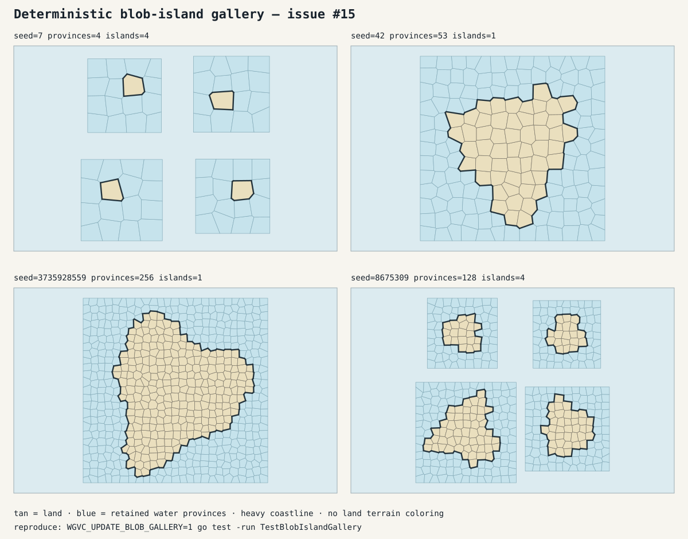

# Blob-island generation

`Generate` builds irregular Voronoi islands while preserving its original
public contract: callers provide only `WorldSeed`, `ProvinceCount`, and
`IslandCount`, and receive exactly those land province and island counts.
Water candidates, shape parameters, selection order, and placement envelopes
remain private. The public types and function signature are unchanged.

The approach is inspired by Amit Patel's
[Polygonal Map Generation for Games](http://www-cs-students.stanford.edu/~amitp/game-programming/polygon-map-generation/):
generate a complete polygon map, classify land against surrounding ocean, and
retain shared topology. This package does **not** implement the article's
elevation, hydrology, moisture, climate, biome, or noisy-rendering systems.
Lakes, rivers, routes, and rendering-only edge subdivision are also outside
this generator.

## Stage order

For every successful generation:

1. Validate `ProvinceCount >= IslandCount >= 1`.
2. Allocate the exact land count with descending Fibonacci weights.
3. Build each island's deterministic candidate sites and independent blob
   shape phases.
4. Tessellate and canonicalize the complete candidate map in `[0,1]²`.
5. Reserve clipping-frame cells as ocean and select exactly the allocated
   number of edge-connected interior cells. Every omitted candidate remains
   connected through omitted cells to frame water, so no lake is enclosed.
6. Extract selected cells from the existing map. Unused corners and edges are
   removed and IDs are compacted. A retained/omitted shared edge becomes a
   one-incidence coastline edge. The selected sites are never retessellated.
7. Measure retained polygon area and uniformly scale the island so land area
   equals its allocation. Place complete candidate envelopes with guaranteed
   water gaps; using the envelope rather than tight land bounds preserves room
   for the private surrounding ocean.
8. Assemble compact world-global IDs and assign terrain last.

Every public province remains finite, convex, counterclockwise, positive-area,
and center-containing. Every island is one authoritative shared-edge land
component. Coastlines are canonical single loops with no orphan corners or
edges, islands do not share adjacency, and total land area remains one world
area unit per province.

## Shape resolution

The coastline follows whole retained Voronoi cells. This makes bays,
promontories, and seed-dependent outline variation visible on medium and large
islands without changing polygon edges only for rendering. It also imposes a
deliberate resolution limit: a one-province island is one convex polygon, and
very small islands have only a few cells with which to express their outline.
Coastline complexity increases with province count.

Candidate capacity is bounded rather than retry-based. For `n` land cells, the
smallest interior square side `s` satisfying `s² >= 2n` is surrounded by a
one-cell frame. Sites are sampled inside those slots. Selection remains
row-convex, which guarantees progress, land connectivity, and an exterior path
for all omitted water.

## Determinism and regression coverage

Random stages use locally constructed `math/rand/v2` PCG streams derived from
the world seed and separate domains for candidate sites, each island's shape,
placement, and terrain. Random consumption in one domain cannot perturb any
other domain. Identical configurations produce deeply identical worlds for a
fixed generator version; a later generator version may intentionally update
the fixtures and output.

The exhaustive small-world matrix covers every valid province/island count
through 12 across three seeds. Fixed medium, asymmetric multi-island, and large
fixtures additionally lock exact corner, edge, and coastline counts plus
normalized coastline signatures. Tests independently check pre-extraction
frame exclusion and exterior-water connectivity, post-extraction land
connectivity, canonical coastline loops, compact topology without orphans,
island separation, area scaling, geometry, terrain, full-world determinism,
and concurrent race safety. Shape assertions require sufficiently large
fixtures to have non-square, concave silhouettes; distinct signatures ensure
the retained fixtures do not collapse to one repeated outline.

The SVG gallery is generated by test-only code and is not part of the public
rendering API. It uses a uniform land fill, thin province boundaries, and a
heavy coastline so terrain does not obscure shape. Tests compare deterministic
SVG source, not screenshots or raster pixels; structural regressions do not
depend on the image comparison.



Regenerate the labeled gallery, including its recorded seed and count inputs,
with one command from the repository root:

```sh
WGVC_UPDATE_BLOB_GALLERY=1 go test -run TestBlobIslandGallery
```

Run all structural and race checks with:

```sh
go test ./...
go test -race ./...
```
