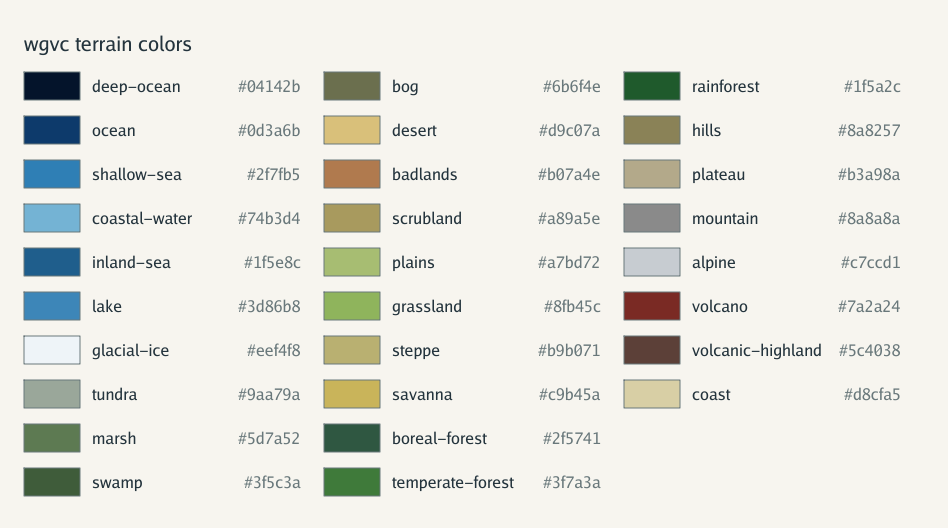

# Terrain legend

Every `wgvc.Terrain` value, in `wgvc.Terrains()` order, with the fill color
`cmd/generate` uses for it in SVG and PNG maps.



The image is a golden output of `TestTerrainLegend`. After changing a color or
the terrain list, regenerate it with:

```sh
WGVC_UPDATE_TERRAIN_LEGEND=1 go test -run TestTerrainLegend ./cmd/generate
```

## How terrain is assigned

Terrain is classified after elevation, relief, climate, and basins. It never
changes land/water membership: `Province.IslandID` decides whether a province
is land or water, and the rules below then choose a terrain on that side.
Values used:

- **Elevation** is in `[-1, 1]`. Water is always `≤ 0` and land `≥ 0`.
  Land bands: lowland `< 0.2`, upland `< 0.4`, highland `< 0.6`, mountain
  above that. Water below `-0.5` is the deep-water band.
- **Relief** is in `[0, 1)`: the mean elevation difference to same-medium
  neighbors.
- **Heat band** is polar, cold, temperate, warm, or hot. **Moisture band** is
  arid, dry, moderate, humid, or saturated.

### Water

Water rules are checked in this order. A province takes the first that matches.

| Terrain | Color | Rule |
|---|---|---|
| `inland-sea` | `#1f5e8c` | Member of a basin (water with no path to the world boundary) of 10 or more provinces. Overrides every other water rule. |
| `lake` | `#3d86b8` | Member of a basin of fewer than 10 provinces. Overrides every other water rule. |
| `coastal-water` | `#74b3d4` | Shares an edge with land. |
| `deep-ocean` | `#04142b` | Deep-water elevation band (elevation `< -0.5`). |
| `ocean` | `#0d3a6b` | Elevation `≤ -0.1`. |
| `shallow-sea` | `#2f7fb5` | Any other water. |

### Land

Land rules are checked in this order. A province takes the first that matches.

| Order | Terrain | Color | Rule |
|---|---|---|---|
| 1 | `glacial-ice` | `#eef4f8` | Polar heat and moisture wetter than arid. |
| 2 | `alpine` | `#c7ccd1` | Mountain band, polar or cold heat. |
| 2 | `mountain` | `#8a8a8a` | Mountain band, temperate or warmer. |
| 3 | `mountain` | `#8a8a8a` | Highland band, relief `≥ 0.16`. |
| 3 | `plateau` | `#b3a98a` | Highland band, relief `< 0.07`: high and flat. |
| 3 | `hills` | `#8a8257` | Highland band, relief from `0.07` to `0.16`. |
| 4 | `bog` | `#6b6f4e` | Lowland wetland (relief `≤ 0.12`, humid or saturated), polar or cold. |
| 4 | `marsh` | `#5d7a52` | Lowland wetland, temperate. |
| 4 | `swamp` | `#3f5c3a` | Lowland wetland, warm or hot. |
| 5 | `coast` | `#d8cfa5` | Lowland, elevation `≤ 0.04`, shares an edge with water. |
| 6 | `badlands` | `#b07a4e` | Arid or dry, relief `≥ 0.20`. |
| 7 | `hills` | `#8a8257` | Upland band, relief `≥ 0.14`. |
| 8 | cover | | Everything else takes a cover terrain from the heat × moisture table below. |

Cover terrain by heat (rows) and moisture (columns):

| | arid | dry | moderate | humid | saturated |
|---|---|---|---|---|---|
| **polar** | tundra | tundra | tundra | tundra | tundra |
| **cold** | tundra | steppe | boreal-forest | boreal-forest | boreal-forest |
| **temperate** | scrubland | grassland | plains | temperate-forest | temperate-forest |
| **warm** | desert | scrubland | savanna | temperate-forest | temperate-forest |
| **hot** | desert | scrubland | savanna | rainforest | rainforest |

Only the arid column of the polar row is reachable, because rule 1 turns polar
provinces with any moisture into glacial ice.

Cover terrain colors:

| Terrain | Color |
|---|---|
| `tundra` | `#9aa79a` |
| `steppe` | `#b9b071` |
| `boreal-forest` | `#2f5741` |
| `scrubland` | `#a89a5e` |
| `grassland` | `#8fb45c` |
| `plains` | `#a7bd72` |
| `temperate-forest` | `#3f7a3a` |
| `desert` | `#d9c07a` |
| `savanna` | `#c9b45a` |
| `rainforest` | `#1f5a2c` |

### Reserved

| Terrain | Color | Status |
|---|---|---|
| `volcano` | `#7a2a24` | Declared and colored but never assigned. See #40. |
| `volcanic-highland` | `#5c4038` | Declared and colored but never assigned. See #40. |
