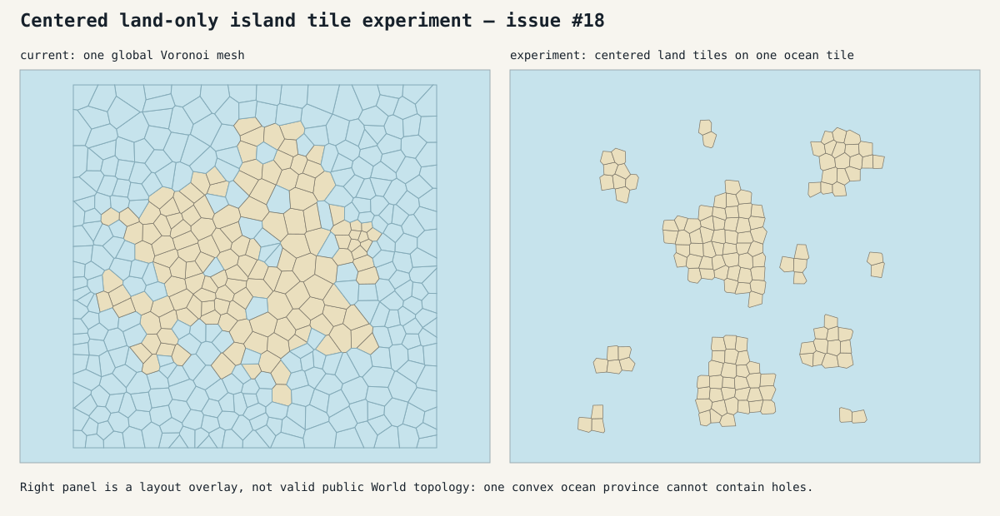

# Centered land-only tile experiment

Issue #18 tests an alternative to constructing one Voronoi diagram from every
placed candidate site. It is intentionally isolated on an experiment branch
and must not be merged without human approval.

## Spike construction

1. Generate and select each island using the existing deterministic blob
   process.
2. Discard every unselected candidate cell, leaving a land-only mesh.
3. Scale the retained land to one world area unit per province.
4. Translate the tight land bounds so their center is local coordinate `(0,0)`.
5. Create one square ocean container.
6. Place the centered island tiles with deterministic seeded rejection packing,
   expanding the ocean container if necessary. Tight tile bounds maintain the
   required water gap and outer margin.

The spike preserves exact land counts, land area, island-local topology,
determinism, and non-overlap. It also removes the row-major placement grid.

## Topology finding

The overlay is not directly representable as the current public `World`.
`Province.CornerIDs` describes one counterclockwise convex ring with no repeated
corners. One ocean province is therefore a convex polygon and cannot contain
island-shaped holes. Placing independent land meshes over that polygon creates
overlapping geometry, and their coastline edges are not shared with the ocean
province.

A production version of this model would need an additional assembly stage
that subtracts every island footprint from the ocean and decomposes the
remaining multiply connected region into valid water provinces. That stage
would need to create canonical shared coastline corners and edges, preserve
the exact island polygons, and prove complete coverage without overlaps or
gaps. In effect, the "single ocean tile" can be a placement container, but it
cannot remain a single public province under the current contract.

The experiment is useful as a placement model, but it does not yet replace the
world-level Voronoi construction from issue #16.



Regenerate the visual fixture from the repository root with:

```sh
WGVC_UPDATE_TILE_EXPERIMENT=1 go test -run TestCenteredIslandTileGallery
```
